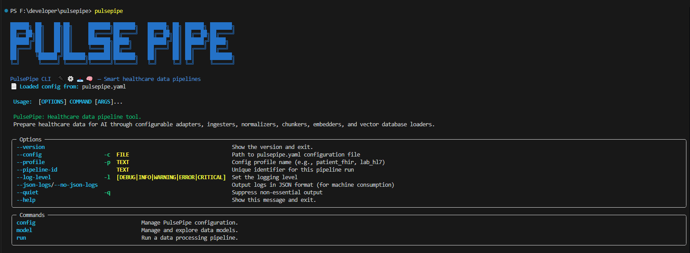
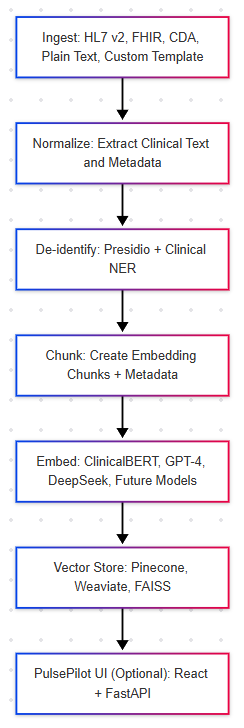

# PulsePipe

**PulsePipe** is a modular, AI-native healthcare data pipeline. It ingests clinical data (HL7 v2, FHIR, X12, CDA/CCDA, plain text, and custom templates), de-identifies and normalizes it, prepares it for LLM-friendly text processing, and generates vector representations for AI/ML tasks.

PulsePipe transforms healthcare data into embedding-ready chunks annotated with rich metadata (patient hashes, timestamps, note types, etc.). It supports generating multiple vector formats via configurable embedding engines (ClinicalBERT, GPT-4, Llama v4, and others) for use in vector databases such as Pinecone, Weaviate, or FAISS.

## 🚀 Use Cases

PulsePipe is designed for AI-powered healthcare applications including:
- Clinical semantic search
- Clinical decision support
- Patient similarity matching
- Embedding-driven analytics
- Hybrid structured + unstructured data pipelines
- **Local question-answering on clinical data** - ask questions about patient history, treatments, and outcomes without sending PHI to external services
- **Operational analytics** - analyze resource utilization, workflows, and quality metrics using natural language queries

---

## ✨ Features

- **Modular multi-format ingestion**: FHIR, HL7 v2.x, CDA/CCDA, Plain Text
- **Canonical Clinical Data Model** (Pulse Clinical Content)
- **De-identification Module** using Presidio + Clinical NER models (optional)
- **Embedding-ready Pipeline**: Produces vector-ready chunks for AI/ML tasks
- **Multiple embedding models** support: ClinicalBERT, GPT-family, Llama v4, etc.
- **Multi-embedding generation**: Generate several embedding formats per chunk
- **Metadata-first design** for context-rich, patient-safe vector chunks
- **Flexible vector storage**: Pinecone, Weaviate, FAISS, or custom backends
- **RAG (Retrieval-Augmented Generation)**: Combines generative models with local data retrieval to enhance AI-driven analysis. For detailed insights, refer to the whitepaper.
- **Built on `pydantic`** for strict schema validation
- **Modern Python toolchain** compatibility (Poetry, Pytest, Mypy)
- **AI/NLP enhanced** ingestion pipelines
- **On-premises execution**: Run completely locally within your secure environment for maximum data privacy

---

## ⚡ Supported Ingestors

| Ingestor | Description |
|----------|-------------|
| FHIR | Supports FHIR `JSON` or `XML` resources |
| HL7 | Supports HL7 v2.x message ingestion (ADT, ORU, ORM, etc.) |
| CDA | Supports CDA/CCDA XML documents (e.g., Discharge Summaries, AVS) |
| X12 | Supports X12 healthcare claim, authorization, and eligibility transactions (e.g., 837, 835, 270/271) with configurable parsing and segment-level access |
| PlainText | Supports unstructured clinical notes |
| Custom Template | Allows you to define and extend your own ingestion logic for proprietary or domain-specific formats |

---

## ✅ End-to-End Pipeline

1. **Ingest**  
   Accepts HL7, FHIR, CDA, X12, PlainText, or custom template input.

2. **Normalize**  
   Converts input into the Pulse Canonical Model — a standardized, AI/analytics-ready clinical representation.

3. **De-identify**  
   Removes PHI using Presidio and Clinical NER models such as BioClinicalBERT or medSpaCy.

4. **Chunk**  
   Splits de-identified clinical narratives into embedding-friendly chunks with metadata.

5. **Embed**  
   Generates one or more embedding vectors per chunk using:
   - ClinicalBERT (local)
   - OpenAI GPT-family (via API)
   - Llama v4 (optional)
   - Other pluggable embedding models

6. **Store**  
   Embeddings and metadata are persisted into:
   - Pinecone
   - Weaviate
   - FAISS
   - or a custom vector backend

7. **(Optional) PulsePilot UI**  
   Optional web-based UI (React + FastAPI) for search, similarity exploration, and analytics.

---

## 🖥️ CLI Screenshot



When you launch the CLI, you'll see a startup banner and environment summary like this, including loaded configuration and available commands.

---

## 📦 Installation & Setup

### Using Poetry (Recommended)

```bash
# Install dependencies and set up virtual environment
poetry install

# Build project
poetry build

# (Optional) Publish build artifacts
poetry publish --repository <repo>

# Open Python REPL with managed virtualenv
poetry run python
```

### Docker Setup for Vector Databases

PulsePipe works with various vector databases which can be easily set up using Docker. We provide ready-to-use configurations for Weaviate and Qdrant to simplify your development and testing process.

```bash
# Navigate to the vector database setup directory
cd tests/docker_environment/vectordatabases

# Start Weaviate and Qdrant
docker compose up -d

# Check running containers
docker ps

# Stop the databases
docker compose down
```

The `docker-compose.yaml` includes:

#### Weaviate Configuration
```yaml
weaviate:
  image: semitechnologies/weaviate:1.27.17
  ports:
    - "8080:8080"    # HTTP API
    - "50051:50051"  # gRPC API
  environment:
    ENABLE_MODULES: ""
    DEFAULT_VECTORIZER_MODULE: "none"
    ENABLE_GRPC: "true"
    CLUSTER_HOSTNAME: "node1"
```

#### Qdrant Configuration
```yaml
qdrant:
  image: qdrant/qdrant
  ports:
    - "6333:6333"
  healthcheck:
    test: ["CMD", "wget", "--spider", "http://localhost:6333/collections"]
    interval: 10s
    timeout: 5s
    retries: 5
```

For production deployments or custom configurations, you can modify the environment variables and port mappings as needed.

---

## 🧪 Testing & 🐞 Debugging

```bash
# Run all unit tests
poetry run pytest -s

# Run specific test
poetry run pytest -s tests/test_hl7v2_ingester.py

# Generate coverage report
poetry run pytest --cov=src/ --cov-report=term-missing tests/

# Type checking (static analysis)
poetry run mypy src/ tests/

# Linting and formatting
poetry run black --check src/ tests/
poetry run isort --check-only src/ tests/

# Auto-fix formatting
poetry run black src/ tests/
poetry run isort src/ tests/


# Coverage Report (Make sure to turn off stdout/stderr on Windows with -s)
poetry run pytest --cov=pulsepipe tests/ -s

# Coverage Report with missing items
poetry run pytest --cov=src/pulsepipe --cov-report=term-missing tests/ -s

# Coverage Report with missing items html report
poetry run pytest --cov=src/pulsepipe --cov-report=term-missing --cov-report=html tests/ -s

```

---

## 🛠️ Usage

PulsePipe is designed for CLI-first interaction. Once installed, run pipelines using:

```bash
# Basic pipeline execution
pulsepipe run --profile <your_profile>

# Run with summary report
pulsepipe run --profile patient_fhir --summary

# Print normalized data model
pulsepipe run --profile patient_fhir --print-model

# Run using adapter + ingester configs directly
pulsepipe run --adapter adapter.yaml --ingester ingester.yaml

# Run all pipelines from a pipeline.yaml
pulsepipe run --pipeline-config pipeline.yaml
```

### Configuration Management

```bash
# Validate a config
pulsepipe config validate --profile patient_fhir

# List processed files for file watcher
pulsepipe config filewatcher list

# View model schemas
pulsepipe model schema pulsepipe.models.PulseClinicalContent
```

### 💬 Clinical and Operational Chat Prompts

PulsePipe's vector embeddings enable powerful question-answering capabilities over clinical data. Below are example prompts for common clinical and operational use cases.


### 💬 Clinical and Operational Chat Prompts

PulsePipe's vector embeddings enable powerful question-answering capabilities over clinical data. Below are example prompts for common clinical and operational use cases.

#### Clinical Chat Prompts

```
# Medication Review (Patient)
Are there any potential drug interactions or conflicts with the medications
I am currently taking, including over-the-counter drugs?

# Medication Adherence (Patient)
How can I better manage my medication schedule and ensure I’m taking my medications
as prescribed?

# Medication Adherence (Guardian/Caretaker)
Based on my loved one's medication record, are there any duplicate medications
or overlapping ingredients that could lead to accidental overdosing or adverse effects?

# Medication Monitoring (Guardian/Caretaker)
What signs should I look for to detect potential side effects or reactions from
the medications my loved one is taking?

# Medication Reconciliation (Nurse/PA/APN)
Does this patient's current medication list include prescriptions that were filled
but are no longer in use or do not align with any current diagnoses (e.g., short-term
medications like antibiotics or pain relievers)? Please highlight any discrepancies.

# Patient Monitoring (Nurse/PA/APN)
Based on the patient's current vital signs and medication list, which areas of
concern should I monitor most closely in the next 24 hours?

# Treatment Adjustments (Physician)
Given this patient's current medication list and comorbidities, what treatment
adjustments should be made to improve their overall health outcome?

# Medication Optimization (Physician)
Based on this patient’s diabetes and hypertension medications, which additional
treatment options should we consider to prevent complications like CHF or CKD?
```

#### Operational Chat Prompts

```
# Billing and Denials
Which procedures had the highest denial rates last quarter and what documentation issues contributed?

# Workforce Efficiency
Identify departments with the most overtime logged and does it align with patient acuity data?

# Service Line Profitability
Which service lines generated the highest revenue per encounter last quarter, and how does that compare to staffing and supply costs?

# Revenue Cycle Health
What are the top reasons for delayed payments from insurers in the past 6 months?

# Clinical Outcome Risk Patterns
Which clinical pathways show the highest variance between expected and actual outcomes, and what operational factors (delays in care, missed protocols, communication gaps) are driving poor quality metrics that could trigger CMS penalties?

# Nursing-Sensitive Quality & Staffing Analysis
What is the correlation between nursing staffing ratios and our nursing-sensitive quality indicators (falls, pressure injuries, CAUTI, CLABSI) across all units, and which departments are approaching unsafe thresholds that require immediate staffing intervention?
```

Configure these prompts in your application by using PulsePipe's embedding context:

```python
from pulsepipe.chat import PulseChat

# Initialize chat with your vector database
chat = PulseChat(vector_store="weaviate", collection="patient_data")

# Run a clinical query with metadata filters
response = chat.query(
    prompt="What treatment options were considered for this patient's condition?",
    filters={
        "patient_id": "123456",
        "date_range": {"from": "2023-01-01", "to": "2023-06-30"},
        "document_types": ["progress_notes", "consults"]
    }
)
```

For **full CLI documentation**, see  
📄 [`src/pulsepipe/cli/README.md`](src/pulsepipe/cli/README.md)

---

## 📜 License

PulsePipe is licensed under the **GNU Affero General Public License v3.0 (AGPL-3.0)** — and that's on purpose.

We believe that foundational healthcare infrastructure should:
- Be open
- Improve with community contributions
- Avoid proprietary lock-in

By using AGPL:
- We ensure that if you run PulsePipe as part of a distributed system or as a service, you must share back your improvements.
- This protects the broader healthcare community while allowing commercial use under clear terms.

Non-profits, hospitals, academic institutions, government organizations, and individual researchers may use, modify, and deploy PulsePipe for **non-commercial** purposes without triggering AGPL Section 13.

For full details, see the [LICENSE](./LICENSE.md) and [LICENSE-EXCEPTIONS](./LICENSE-EXCEPTIONS.md) files.

---

## 📈 Architecture Diagram



---

## 🤝 Contributing

We welcome contributions! Please see our [Contributing Guide](CONTRIBUTING.md) for details on how to get started.

## 🗺️ Roadmap

PulsePipe is under active development! Check out our detailed [Roadmap](ROADMAP.md) to see our current progress, milestone completion status, and planned features for future releases.

## 📞 Support

- GitHub Issues: For bug reports and feature requests
